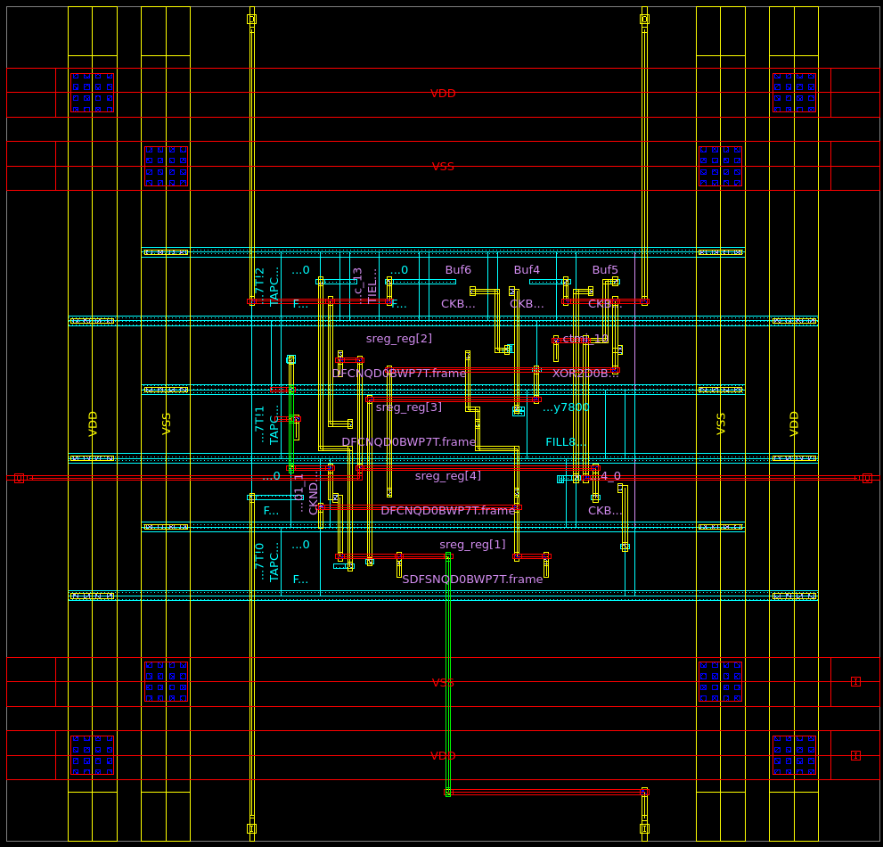

##### Imperial College London, Department of Electrical & Electronic Engineering


#### ELEC70142 Digital VLSI Design

### Lab 1 - A Quick Start with Synopsys

##### *&lt;author&gt;, v1.0 - &lt;date&gt;*

---
### Objectives
---
By the end of this laboratory session, you should be able to do the following.
* Set up your personal laptop environment for **Synopsys EDA software** running on our teaching servers.
* Use **_Fusion Compiler_** to synthesize a simple circuit from **HDL to standard cells**.
* Understand the **steps required** to take a RTL specification to silicon using standard cells.
* Interpret the **timing**, **area** and **power** reports produced by the tool.
* Use **_Fusion Compiler_** to **place and route** the synthesized circuit.
* Understand how to write a **Tcl script** to perform synthesis and place-and-route.
* Run the tool's own **verification checks** on the layout, and know what they do and do not prove.
* Use the **_VCS_** simulator to **verify** that the synthesised and place-and-routed circuit works.
* Use **_GTKWave_** to inspect simulation results.
* Understand what **physical synthesis** is, and measure what it buys you.
* Inspect the resulting **silicon layout** of the circuit.

---
### Before you start
---

>Before you even start this laboratory session, you must have signed the TSMC's **non-disclosure agreement (NDA)**, and have returned this to me.  Remember that you MUST abide by the restrictions stipulated in the NDA.

Although you could use the PCs provided by the Department in Room 507 for this lab, I recommend that you bring your own laptop. There are many display units in the room for you to plug in your laptop and use a larger screen for this lab. You will be working in pairs.

If you are using a Windows PC, you will need to have [MobaXterm](https://mobaxterm.mobatek.net) installed via College's [software hub](https://softwarehub.imperial.ac.uk). This provides a feature-rich terminal environment with built-in X server and ssh client.

If you are a MacBook user, you already have the Terminal application as part of OSX. You also need to install [XQuartz](https://www.xquartz.org) X server.

> You will open three graphical windows in this lab: the Fusion Compiler layout viewer, GTKWave, and optionally Verdi. All three need a working X server, so connect with `ssh -Y` and do not skip the X server installation.

You may also want to clone this repo onto your own laptop, so that you have a local copy of the instructions and related files. As part of the assessment, you are expected to keep and show your logbook to your assessor during the mid-term Lab Oral. You may keep your logbook using any application you wish, e.g. MS WORD, MS OneNote, Obsidian or Notion. However, one possible choice is to keep your logbook with your cloned repo.

If you are EE4 students, you may not have extensive exposure to Github and Markdown language. I am afraid you will have to learn these skills taking this module. Your final project submission will have to be in the form of a Github repo. In any case, all EEE graduates should be familiar with these skills.

---
### Task 1 - Connect to the Teaching Server and Load the Tools
---

**_Step 1: Connect_**

To access Imperial College's resources from your personal laptop when you are not in College, you will need to connect to the Universal Access provision after running [Zscaler](https://www.imperial.ac.uk/admin-services/ict/self-service/connect-communicate/remote-access/unified-access/). After authentication, you will be able to access file systems and computer servers.

Synopsys is installed and runs on the EEE teaching servers, which you access via SSH. There are two servers available:

* ee-mill1.ee.ic.ac.uk
* ee-mill2.ee.ic.ac.uk

To balance the loading on these two servers, please use **_ee-mill1_** if your group number is **odd**, and **_ee-mill2_** if it is **even**. A list of groups can be found [here](group_allocation.txt).

For **Windows**: Use [MobaXterm](https://mobaxterm.mobatek.net) to create a new session by entering the server address with your username and password.

For **Mac**: Use [XQuartz](https://www.xquartz.org). After installation and opening XQuartz, enter:
```bash
ssh -Y <username>@ee-mill1.ee.ic.ac.uk
```

**_Step 2: Get the lab files_**

Unlike previous years, you are not asked to create the directory structure and type in the source by hand. Copy this repository to your home directory on the server and move into the Lab 1 folder:

```bash
cd ~/labs_synopsys/Lab_1
ls
```

Everything you need is already there:

| Path | What it is |
|---|---|
| `src/lfsr4.sv` | the design |
| `src/lfsr4_tb.sv` | the testbench |
| `constraints/lfsr4.sdc` | the timing constraints |
| `scripts/setup.tcl` | design name, file paths and the settings you may want to change |
| `scripts/mcmm.tcl` | modes, corners and scenarios |
| `scripts/floorplan.tcl` | core area, power grid, tap cells, pins |
| `scripts/backend.tcl` | clock tree, routing, chip finish and export |
| `scripts/syn_logical.tcl` | Task 2 |
| `scripts/pnr.tcl` | Task 3 |
| `scripts/fusion.tcl` | Task 5 |
| `Makefile` | Task 4 |

Four directories appear as you work and hold everything the tools produce:

* **work** - the design libraries, where the tool keeps the design itself
* **outputs** - netlists, SDF, DEF, LEF and SPEF, one folder per flow
* **reports** - every report, one folder per flow
* **sim** - simulation binaries and waveforms

The design is the 4-bit linear feedback shift register from the 2nd year labs. Open `src/lfsr4.sv` and read it before you go further:

```v
module lfsr4 (
    // simple 4-bit linear feedback shift register.
    // primitive polynomial is x^4 + x^3 + 1
    // Author: Peter YK Cheung
    // Version: 1.0, 17-9-25

    input logic         clk,        // clock
    input logic         rst,        // reset
    output logic [3:0]  data_out    // pseudo-random output
);

logic [4:1]     sreg;

always_ff @ (posedge clk, posedge rst)
    if (rst)
        sreg <= 4'b1;
    else
        sreg <= {sreg[3:1], sreg[3] ^ sreg[4]};

assign data_out = sreg;
endmodule
```
<p align="center">  </p><BR>

> College has removed the ability to use Network File System (NFS) and autosynch your files. To edit a file on your laptop and copy it across, use secure copy:
```bash
scp lfsr4.sv <user_name>@ee-mill1.ee.ic.ac.uk:labs_synopsys/Lab_1/src/.
```

**_Step 3: Specify the PDK for your design_**

Before you start, you need to specify which **_process design kit (PDK)_** you will be using. From the top of the repo, enter:

```bash
cd ~/labs_synopsys
tools/syn
```

This lists all the PDKs available. Choose the TSMC 65nm low power process by entering:

```bash
tools/syn tsmc65LP
```

> The *_tools/syn_* command must be run every time before you run your **_first_** Synopsys EDA tool. It sets the environment variables the tools need, puts them on your PATH, and selects the TSMC 65nm low power process for the rest of the session.
>
> Two things to know about it. It gives you a **fresh tcsh shell**, so if you want to save a tool's output to a file the syntax is `|& tee file.log` and not the bash `2>&1 | tee`. And it loads **one PDK per shell**: to switch, type `exit` first.

**_Step 4: Check the libraries are in place_**

Fusion Compiler does not read the foundry's Liberty and LEF files directly. It reads a **NDM** library, which has already been built for you from them. Confirm it is there:

```bash
fc_shell -f tools/check_ndm.tcl
```

You should see `PASS`, and `28 of 28 special cells`. If you do not, stop and ask a demonstrator; nothing later in this lab will work.

Now move into the lab folder, where you will stay for the rest of the session:

```bash
cd Lab_1
```

---
### Task 2 - Synthesize RTL to Standard Cells
---

Synthesis turns your RTL description into a netlist of standard cells from the TSMC library. In this task you will do it the traditional way: **logical synthesis**, in which the tool knows nothing about where anything will physically sit and assumes every wire has zero delay. Task 5 shows you the alternative.

**_Step 1: Launch the tool_**

```bash
fc_shell
```

When you see the prompt **_fc_shell>_**, you are inside the tool.

Fusion Compiler accepts **_Tcl_** scripts (**T**ool **C**ommand **L**anguage). While you may want to learn Tcl for personal interest, you are not going to use any complex syntax of Tcl in this lab. If you want to find out more about Tcl, here are some useful resources:

* a [tutorial video](https://www.youtube.com/watch?v=o_mhSa5HQCc) on Tcl;
* a 3-page [online tutorial](https://www.asic-world.com/scripting/tcl1.html);
* a comprehensive [cheatsheet](https://cheatography.com/aha/cheat-sheets/tcl-language/).

> At any point, `man <command>` inside `fc_shell` gives you the full documentation for a command, and `help <pattern>` lists commands whose names match. Both are worth using as you go.

**_Step 2: Load the lab settings_**

Enter these Tcl commands in Fusion Compiler:

```tcl
set FLOW logical
source scripts/setup.tcl
```

This is bookkeeping rather than EDA, which is why you source it instead of typing it. Open `scripts/setup.tcl` and read it now. It does three things: it loads the PDK description that `tools/syn` selected, it names the design and its files, and it sets the handful of numbers you are allowed to change:

```tcl
set CORE_UTIL   0.6         ;# fraction of the core available to cells
set ASPECT      1.0         ;# core height / width
set CORE_OFFSET 5           ;# core to die edge, um

set RING_WIDTH   1.0        ;# power ring, um
set RING_SPACING 0.5
set RING_OFFSET  1.25
```

Notice what is **not** in there: no path to the TSMC libraries, and no cell names. Those live in the PDK description, so these scripts would work against a different process without editing. Notice also that the clock is not there either. It lives in the constraints file, which is where a real design keeps it.

**_Step 3: Create the design library_**

Enter these Tcl commands in Fusion Compiler:

```tcl
create_lib $SYN_LIB -technology $TECH_FILE -ref_libs $REF_LIBS
report_ref_libs
```

A **design library** is where the tool keeps your design. It is created against a **technology file**, which describes the metal layers, and one or more **reference libraries**, which describe the standard cells.

> Look at what `report_ref_libs` printed. There are **two** reference libraries, not one. The first holds every cell with timing information. The second holds the cells that have no timing at all: the filler cells and the tap cell, which have no logic function and no pins except power. You will meet both in Task 3.

**_Step 4: Read the design_**

Enter these Tcl commands in Fusion Compiler:

```tcl
set_non_physical_mode

analyze -format sverilog $RTL_FILES
elaborate $DESIGN
set_top_module $DESIGN
```

`set_non_physical_mode` is what makes this logical synthesis: it tells the tool not to keep any physical data. It has to come before the design is read.

`analyze` checks the HDL and stores it. `elaborate` builds the design from it, resolving parameters and inferring registers.

> Read the elaboration output carefully. It names every register the tool inferred from your RTL. A register you did not expect is the earliest and cheapest sign of an RTL bug.

**_Step 5: Set up the constraints_**

Enter these Tcl commands in Fusion Compiler:

```tcl
set PHYSICAL 0
source scripts/mcmm.tcl

report_clocks
```

Open `scripts/mcmm.tcl` and read it alongside the output. Three words matter, and they are the tool's own vocabulary:

* a **mode** is what the chip is doing. This design has one, called `func`.
* a **corner** is a set of physical conditions: process, voltage and temperature.
* a **scenario** is a mode analysed at a corner. Timing analysis runs on scenarios.

Three corners are set up, and each does the job it is good for:

| Corner | Silicon | Voltage | Temperature | Used for |
|---|---|---|---|---|
| `wc` | slow | 1.08 V | 125 °C | setup timing, transition and capacitance limits |
| `bc` | fast | 1.32 V | 0 °C | hold timing |
| `tc` | nominal | 1.20 V | 25 °C | power |

> Why is hold checked at the fast corner and setup at the slow one? Convince yourself before moving on. Checking both at the same corner, which is a common shortcut, checks one of them and not the other.

The timing constraints themselves are in `constraints/lfsr4.sdc`, and the same file is read into all three scenarios. Open it:

```tcl
create_clock -name clk -period 1.0 [get_ports clk]
set_clock_uncertainty 0.02 [get_clocks clk]
set_clock_transition 0.05 [get_clocks clk]
set_max_transition 0.2 [current_design]
set_input_delay  0.2 -clock clk [get_ports rst]
set_output_delay 0.2 -clock clk [get_ports data_out[*]]
set_load 0.01 [all_outputs]
```

A 1 ns period is a 1 GHz clock. The uncertainty stands in for jitter and, until the clock tree is built in Task 3, for the skew it will have.

**_Step 6: Synthesize to gates_**

Enter this Tcl command in Fusion Compiler:

```tcl
compile_logical
```

This is the whole of synthesis in one command. Internally it maps your RTL to generic gates, then to real TSMC cells, then optimises the result against the constraints you just read.

**_Step 7: Write the reports and export the design_**

Enter these Tcl commands in Fusion Compiler:

```tcl
report_area
report_qor
report_timing -delay_type max -max_paths 10
report_power -scenarios func_tc

write_verilog $SYNTH_V
write_sdc -output $SYNTH_SDC

save_block
save_lib
```

Now leave the tool with `exit` and look at what you produced:

```bash
ls outputs/logical
cat outputs/logical/lfsr4_synth.v
```

> * Examine the synthesized Verilog file and satisfy yourself that it is what you expected.
> * What standard cells were used, and how many of each?
> * What is the cell area, and what is the worst setup slack?
> * The netlist and the SDC are the **only** two files Task 3 needs. Everything else is scaffolding. Why is that enough?

**_Step 8: Run the whole thing as a script_**

Every command you just typed is in `scripts/syn_logical.tcl`. Open it and compare it against what you did. Then run the whole of Task 2 as a single command:

```bash
fc_shell -f scripts/syn_logical.tcl
```

> Notice that the tool does not exit when the script finishes. You are left at the `fc_shell>` prompt with the design still open, which is exactly where you want to be if something went wrong.

---
### Task 3 - Place and Route the Standard Cells
---

Place and route turns the netlist into a physical layout: a core area for the cells to live in, a power grid to feed them, a location for every cell, a clock tree, and metal wires connecting everything.

**_Step 1: Create the physical design library and read the netlist_**

Launch `fc_shell` again and enter:

```tcl
set FLOW logical
source scripts/setup.tcl

create_lib $PNR_LIB -technology $TECH_FILE -ref_libs $REF_LIBS

read_verilog -top $DESIGN $SYNTH_V
link_block
```

> This is a **second, separate library**, and the netlist file is the only thing that crosses between them. That is not an accident of these scripts. Synthesis ran in non-physical mode, and a non-physical design cannot be turned into a physical one, so the handoff has to be a file. If you have used other tool flows, this is the same handoff a separate synthesis tool makes to a separate place-and-route tool. Task 5 shows you what happens when you do not make it.

`link_block` resolves every cell instance in the netlist against the reference libraries. A cell that cannot be found is reported here and nowhere later.

**_Step 2: Technology fix-ups and constraints_**

Enter these Tcl commands in Fusion Compiler:

```tcl
set_attribute [get_layers $HORIZONTAL_LAYERS] routing_direction horizontal
set_attribute [get_layers $VERTICAL_LAYERS]   routing_direction vertical
set_attribute [get_site_defs $SITE_NAME] symmetry "$SITE_SYMMETRY"

set PHYSICAL 1
source scripts/mcmm.tcl
```

The first three lines tell the tool which way each metal layer prefers to run, and that a cell row may be flipped. The technology file supplied with this PDK does not say, so without them the tool warns once per layer and then guesses. Its guesses happen to be right, but a log full of warnings is a log nobody reads.

The constraints are the same file as Task 2, with one difference: `PHYSICAL 1` also loads the **TLUPlus** parasitic data, which is how the tool works out the resistance and capacitance of a wire from its length and layer. In Task 2 there were no wires to extract.

**_Step 3: Floorplan, power plan and tap cells_**

Enter this Tcl command in Fusion Compiler:

```tcl
source scripts/floorplan.tcl
```

This one is worth sourcing and then reading, because it is long and every command in it is doing something specific. Open `scripts/floorplan.tcl` and follow along.

**The core.** `initialize_floorplan` creates the area the cells will sit in and fills it with rows:

```tcl
initialize_floorplan \
    -site_def         $SITE_NAME \
    -core_utilization $CORE_UTIL \
    -side_ratio       [list 1 $ASPECT] \
    -core_offset      $CORE_OFFSET
```

`-core_utilization 0.6` means 60 percent of the core is for cells and 40 percent is left for routing. Push it too high and the router runs out of room; too low and the chip is needlessly large. `-core_offset 5` leaves a 5 µm gap between the core and the die edge, which is where the power ring goes.

**The power nets.** A gate is drawn with two pins in RTL and has four in silicon. The Verilog netlist says nothing about power, so the supply nets and every cell's connection to them have to be made here:

```tcl
create_net -power $PWR_NET
create_net -ground $GND_NET
connect_pg_net -automatic
```

**The power plan.** This is built by describing a *pattern*, then a *strategy* that applies the pattern to a region, then calling `compile_pg` to turn the description into actual metal. There are two of them:

* **rails** - one horizontal wire per cell row on M1, which is what the cells themselves connect to. Neighbouring rows are flipped so that they share a rail.
* **ring** - a loop around the core carrying current in from the die edge. The horizontal segments are on M3 and the vertical ones on M2, following the preferred direction of each layer. VSS is the inner ring and VDD the outer one.

**Tap cells.** `create_tap_cells` inserts cells that tie the substrate and wells to the supplies, at most 60 µm apart.

> Tap cells are not optional and the 60 µm is not a preference; it is a rule from TSMC. Without them, the parasitic transistors that exist between neighbouring devices can turn on and **latch up**, shorting supply to ground until power is removed. Find out what latch-up is if you have not met it before.

Now look at what you have built:

```tcl
start_gui
```

You should see an empty core with a power ring around it and rows of empty sites. Nothing is placed yet, and that is the point: a power plan is far easier to understand before there are cells on top of it. Zoom into a corner and find the vias where the M1 rails meet the M2 and M3 ring.

**_Step 4: Placement_**

Enter these Tcl commands in Fusion Compiler:

```tcl
check_design -checks pre_placement_stage

place_opt

add_tie_cells \
    -tie_high_lib_cells [get_lib_cells */$TIE_HI_CELL] \
    -tie_low_lib_cells  [get_lib_cells */$TIE_LO_CELL]

connect_pg_net -automatic

legalize_placement
check_legality
```

`place_opt` does more than placement. It places the cells, then optimises the design now that it knows where they are: resizing cells, adding buffers on long nets, and moving cells that turned out to be badly placed. This is the single biggest difference from the days when synthesis and layout were separate tools that did not talk to each other.

Logic that needs a constant 1 or 0 cannot simply connect to the power rails, because the gate oxide of the transistor it drives would then see the supply directly. `add_tie_cells` provides the constant through a transistor instead.

> `connect_pg_net` is called again, deliberately. It ran during the floorplan, before the tie cells existed, and it does not run itself again. The rule this is an instance of: **anything that inserts cells has to reconnect power afterwards.** You will see it a third time in Step 7.

If `place_opt` fails with `PLACE-006 over utilization`, the core is too small for the design. The message gives you both numbers. Lower `CORE_UTIL` in `scripts/setup.tcl`, which makes the core bigger.

Look at the result in the GUI and compare it with the empty core you saw in Step 3.

**_Step 5: Clock tree synthesis_**

Until now the clock has been *ideal*: every flip-flop was assumed to see the same edge at the same instant. It does not. The clock has to be physically distributed to every flip-flop, and that network is the largest and most heavily loaded net on the chip.

Enter these Tcl commands in Fusion Compiler:

```tcl
set cts_cells {}
foreach c [concat $CTS_BUFFERS $CTS_INVERTERS] { lappend cts_cells */$c }
set cts_cells [get_lib_cells $cts_cells]

set_lib_cell_purpose -exclude cts [get_lib_cells]
set_lib_cell_purpose -include cts $cts_cells

set_clock_tree_options -target_skew 0.2 -clocks [get_clocks $CLK_PORT]
set_max_transition 0.13 -clock_path [get_clocks $CLK_PORT]

clock_opt
```

The first block restricts the clock tree to the library's clock buffers and inverters. These are designed for the job: balanced rise and fall times, and drive strengths in even steps so the tree can be built in regular stages. Ordinary buffers would work electrically and give a worse tree.

`clock_opt` builds the tree, routes it, and then re-optimises the data paths against the real clock arrival times.

```tcl
report_clock_qor
report_clock_timing -type skew
```

> Two numbers to look at, and understand:
> * **skew** is the spread in arrival times between flip-flops. Skew eats directly into your setup margin.
> * **transition** is how sharp the clock edges are. A slow edge wastes power and makes the arrival time ill-defined.
>
> Note that the clock is held to a 0.13 ns transition while the data is allowed 0.2 ns. Why must a clock edge be sharper than the data it launches?

> Hold violations usually appear for the first time at this stage. Why could there not have been any before the clock tree existed?

**_Step 6: Routing_**

Enter these Tcl commands in Fusion Compiler:

```tcl
route_auto
route_opt
check_routes
```

`route_auto` connects every net with real metal on nine layers, obeying TSMC's spacing and width rules. It does it in three passes: global routing decides roughly which channels each net takes, track assignment picks the specific track, and detail routing draws the wires and fixes the rule violations that result.

`route_opt` then re-optimises the timing. Until now, wire delay was an estimate. Now it is a fact.

**_Step 7: Finishing up and checking_**

Enter these Tcl commands in Fusion Compiler:

```tcl
set fillers {}
foreach c $FILLER_CELLS { lappend fillers */$c }
create_stdcell_fillers -lib_cells [get_lib_cells $fillers]

connect_pg_net -automatic
```

The gaps between placed cells are not empty space in silicon. The well and implant layers have to run continuously across a row, and a gap breaks them. Filler cells are dummies that carry those layers through and continue the power rails. They are inserted largest first, so a run of 64 sites becomes one FILL64 rather than sixty-four FILL1s.

Now run the checks:

```tcl
check_legality
check_routes
check_pg_drc
check_pg_connectivity
check_lvs -max_errors 0
```

> **Read the output of every one of these.** They report violations and *still succeed*, so the fact that the tool did not stop tells you nothing at all. A clean run says, in the `check_routes` output:
> ```
> Total number of open nets = 0
> Total number of DRCs = 0
> ```
> One `end-of-line keepout zone violation on M1` from `check_pg_drc` is known and accepted; it is a rule about the inside of a TSMC cell, not a fault in our power plan.

> These five checks are **not signoff**. They are the tool marking its own homework: `check_lvs` here compares the layout against its own connectivity, not against an independent netlist. Real DRC and LVS run in a separate tool against the foundry's own rule decks, and that is Lab 2.

Finally, export everything:

```tcl
write_verilog -exclude {all_physical_cells pg_netlist} $LAYOUT_V
write_def $OUT_DIR/${DESIGN}.def
write_lef $OUT_DIR/${DESIGN}.lef
write_sdc -output $OUT_DIR/${DESIGN}_final.sdc
write_sdf -corner $SDF_CORNER $OUT_DIR/${DESIGN}_${SDF_CORNER}.sdf
write_parasitics -corner $SDF_CORNER -output $OUT_DIR/${DESIGN}

save_block -label finish
save_lib
```

> The exported netlist deliberately leaves out the filler and tap cells, and the power connections. The filler and tap cells have no Verilog model at all, because there is nothing to model: no logic, no timing, no pins except power. The vendor's cell models declare no power ports either. Left in, the simulator in Task 4 refuses to elaborate the design.
>
> Nothing is lost. The design library and the DEF still contain every filler, every tap and every power connection, and those are what a chip is manufactured from. The netlist is a view of the design built for one particular reader.

**_Step 8: Run the whole thing as a script_**

Exit from Fusion Compiler and launch it again, so that you flush out all internal states of the tool. Then run the whole of Task 3 as one command:

```bash
fc_shell -f scripts/pnr.tcl
```

Read `scripts/pnr.tcl` and see how little there is to it: it is the commands you just typed, plus two `source` lines for the floorplan and for everything from clock tree synthesis onwards.

When it finishes you are left at the `fc_shell>` prompt with the finished design open. Look at it:

```tcl
start_gui
```

<p align="center">  </p><BR>

> * Compare the circuit produced after synthesis in Task 2 with the one you have now. Comment on how place and route has modified the original circuit.
> * Examine what has appeared in the `outputs/logical` and `reports/logical` folders.
> * Find a tap cell and a filler cell in the layout. How would you tell them apart?

`syn_logical.tcl` and `pnr.tcl` will now serve as templates for your future designs.

**_Step 9: Changing the aspect ratio of the core_**

Change one line in `scripts/setup.tcl`:

```tcl
set ASPECT 0.1
```

Then run synthesis and place-and-route again:

```bash
fc_shell -f scripts/pnr.tcl
```

> * Discuss with your lab partner how the layout differs from the one you had after Step 8.
> * What has happened to the timing, and why?
> * What could you do to minimise the area taken by this circuit?
>
> You may notice that with `ASPECT` set to 1.0 the core is not exactly square. Look at the height of a single cell row and work out why it cannot be.

Set `ASPECT` back to 1.0 before you move on.

---
### Task 4 - Simulation
---

The placed and routed circuit will now be simulated to make sure that the layout version of the circuit works as expected, using Synopsys' VCS simulator.

You will simulate the same design at **three** points in the flow. Running all three is the quickest way to see what synthesis and layout actually did.

| Simulation | What it is | Delays |
|---|---|---|
| `rtl` | the SystemVerilog you started with | none |
| `synth` | the gate-level netlist from Task 2 | none |
| `layout` | the routed netlist from Task 3 | every gate and wire, back-annotated |

**_Step 1: The testbench_**

Open `src/lfsr4_tb.sv`. It instantiates the design, releases reset, and toggles the clock twenty times:

```v
initial begin
    $dumpfile("waveform.vcd");
    $dumpvars(1, lfsr4_tb, dut);
end
```

Those two lines are what produce the waveform file. `$dumpfile` names it and `$dumpvars` says what to record.

**_Step 2: Simulate the RTL_**

The simulator is driven from a Makefile rather than by hand, because the command lines are long. Enter:

```bash
make sim-rtl
```

This is the design as you wrote it: no cells, no delays, no layout. It is what the circuit is *supposed* to do, and it is your reference for the other two.

**_Step 3: Simulate the synthesised netlist_**

```bash
make sim-synth
```

This is the netlist from Task 2, using real TSMC cells but with zero wire delay. If this matches the RTL, synthesis preserved the behaviour of your design.

**_Step 4: Simulate the layout_**

```bash
make sim-layout
```

This is the routed design from Task 3, with the delay of every gate and every wire read from the SDF file and annotated onto the netlist. This is the circuit running at silicon speed.

> The SDF is written at one corner, and which one you choose changes what you see. `tc` is nominal behaviour; `wc` is the slowest silicon TSMC will ship. To try it:
> ```bash
> make sim-layout SDF_CORNER=wc
> ```
> You will need to re-run `scripts/pnr.tcl` with `SDF_CORNER` changed in `scripts/setup.tcl` first, so that an SDF at that corner exists.

**_Step 5: View the waveforms_**

```bash
make waves KIND=layout_logical
```

A GTKWave window will appear. Clicking on the module and signal names on the left will insert waveforms in the waveform pane. You should see the signal waveforms of the simple "chip" you have created, as shown below.

> Use `<CTRL-0>`, `<CTRL-+>` and `<CTRL-->` keys to fit the whole waveform, zoom in and zoom out respectively.

<p align="center">  </p><BR>

`KIND` selects which of the three simulations to look at: `rtl`, `synth` or `layout_logical`.

> * Check that the output of the LFSR is as you expected. The sequence should be the one you know from the 2nd year lab.
> * Now compare `rtl` against `layout_logical` on the same time axis. The RTL switches its outputs the instant the clock edge arrives; the layout does not. Measure the delay and explain where it comes from.

**_Optional: Verdi_**

Verdi is the Synopsys waveform viewer, and it does something GTKWave cannot: it shows the design as well as the waveforms, so you can click a signal and jump to the source or the schematic that drives it.

```bash
make waves-verdi KIND=layout_logical
```

---
### Task 5 - Physical Synthesis
---

In Task 2, synthesis ran with no idea where anything would end up, so it had to assume every wire had zero delay. It then handed a netlist to Task 3, which discovered the truth. Fusion Compiler can do both jobs in one tool and one database, with synthesis placing cells as it maps them so that it optimises against real wire length estimates. This is **physical synthesis**, and it is the main reason the tool exists.

**_Step 1: Understand what changes_**

Open `scripts/fusion.tcl` and compare it with `scripts/syn_logical.tcl` and `scripts/pnr.tcl` side by side. Almost everything is identical: the same library setup, the same constraints, the same `scripts/floorplan.tcl`, and the same `scripts/backend.tcl` from the clock tree onwards. Only the front end differs:

| | Tasks 2 and 3 | Task 5 |
|---|---|---|
| synthesis | `set_non_physical_mode`, `compile_logical` | `compile_fusion` |
| handoff | a netlist file, then a second library | none, one library throughout |
| placement | `place_opt`, from scratch | carried through from synthesis |

`compile_fusion` runs seven stages in order: `initial_map`, `logic_opto`, `initial_place`, `initial_drc`, `initial_opto`, `final_place`, `final_opto`. In `scripts/fusion.tcl` it is split in two around the floorplan:

```tcl
compile_fusion -to logic_opto
source scripts/floorplan.tcl
compile_fusion -from initial_place -to final_opto
```

> Why the split? `initialize_floorplan` sizes the core from a target utilization, and a utilization is meaningless until there are real cells to measure. Floorplan an unmapped design and the tool tells you so, gives you a core of almost no size, and placement then fails. Stopping at `logic_opto` produces a mapped netlist first, so the floorplan comes out the same as the one Task 3 built, and the two flows stay comparable.

**_Step 2: Run it_**

```bash
fc_shell -f scripts/fusion.tcl
```

Everything lands in `outputs/fusion` and `reports/fusion`, so nothing from Tasks 2 and 3 is overwritten.

**_Step 3: Compare the two flows_**

You now have two complete implementations of the same RTL, built from the same constraints, the same floorplan and the same back end. Compare them:

```bash
diff reports/logical/finish_qor.rpt reports/fusion/finish_qor.rpt
diff reports/logical/finish_area.rpt reports/fusion/finish_area.rpt
```

> * Which flow gives the better final timing, and by how much?
> * Which uses more cells, and which uses more area?
> * Now compare the *synthesis* reports of each flow, `reports/*/synth_timing_max.rpt`, against the *final* reports. In which flow did synthesis predict the final result more accurately? This, rather than the final numbers, is the real answer to what physical synthesis buys you.
> * This design has fifteen nets. Would you expect the difference between the two flows to grow or shrink on a design with fifteen thousand? Why?

**_Step 4: Simulate it_**

```bash
make sim-layout FLOW=fusion
make waves KIND=layout_fusion
```

> Both flows implement the same RTL, so both must produce the same output sequence. If they do not, one of them is wrong. Check.

---
### When something goes wrong
---

Everything in this lab prints to your terminal and nothing is saved unless you ask, so save it:

```bash
fc_shell -f scripts/pnr.tcl |& tee pnr.log
```

Remember that `tools/syn` gives you a tcsh, so it is `|&` and not the bash `2>&1 |`.

Three things to reach for, in order:

* **The reports.** `reports/<flow>/` holds one set of files per stage, so the effect of any stage is a `diff` against the stage before it. If timing collapsed somewhere, this tells you where.
* **The message ID.** Every warning and error from a Synopsys tool ends with a code in brackets, such as `PLACE-006` or `ZRT-064`. Inside `fc_shell`, `man PLACE-006` explains what it means. This is far more useful than searching for the text of the message.
* **The GUI.** If a check reported violations, open the design and look at them:
```tcl
open_lib work/lfsr4_logical.dlib
open_block lfsr4/finish
start_gui
```
The design is saved at every stage under a label, so `lfsr4/floorplan`, `lfsr4/place`, `lfsr4/cts`, `lfsr4/route` and `lfsr4/finish` are all there to open.

If a script stops with a Tcl error, the tool prints the file and line number it stopped at, and leaves you at the prompt with the design in whatever state it reached. That is the best possible place to investigate from, so do not immediately restart.

---
### Test yourself challenge
---
If you have time, you may want to try to create your own circuit and go through the process of synthesis, place and route and simulation.

One suggestion is to design a 16-bit signature analyzer for fault detection and identification. Hewlett-Packard introduced the first commercial signature analyzer (HP5004A) in 1977. This uses a digital probe to compress a digital signal sequence to a unique 16-bit number (the signature), which is then shown on four hexadecimal displays. Equipment under test will go into a test mode and run through a test sequence. Each signal node within the circuit would produce a unique signature, which can be recorded. Any signal node producing a different signature indicates a fault has occurred somewhere. By tracing back the signal path, the faulty node can be identified.

A 16-bit signature analyzer circuit is shown below. You can easily modify the **_lfsr4_** design to this signature analyzer. You should try to change the aspect ratio of the core to see how it affects the resulting circuit.

<p align="center">  </p> <BR>

> To build it, put your Verilog in `src/`, change `set DESIGN` in `scripts/setup.tcl`, and write an SDC for it in `constraints/`. Nothing else in the flow needs to change. If that turns out to be true, the scripts were written properly.

---
### File formats used in this Lab
---

**NDM**
The Synopsys standard cell library format. A single database holding everything about a cell that any stage of the flow needs: timing, power, and the physical abstract used for placement and routing. Other tool flows keep these in separate Liberty, LEF and capacitance table files, and one job of setting up a PDK for Fusion Compiler is building the NDM from them.

**LEF (Library Exchange Format)**
A readable text file that provides an abstract, physical description of a standard cell or predesigned IP block. It contains the information a place-and-route tool needs, such as cell dimensions, pin locations, metal layers and via definitions, without disclosing the transistor-level layout inside. You wrote one out for `lfsr4` in Task 3, which is what would let somebody else use your circuit as a block inside a larger chip.

**SDC (Synopsys Design Constraints)**
A readable text file that specifies timing, power and area constraints for a digital circuit design. It uses Tcl statements to specify parameters such as clock definitions, input and output delays and transition limits. This information is used by EDA tools during synthesis, placement and timing analysis to ensure the design meets its performance requirements.

**MCMM (Multi-Corner Multi-Mode)**
Not a file but a set of commands, in `scripts/mcmm.tcl`, that define the conditions under which the design is analysed. A **mode** is what the chip is doing, a **corner** is a combination of process, voltage and temperature, and a **scenario** is a mode analysed at a corner. Defining several lets the tool check that the chip works across every combination of operating condition and manufacturing variation it will meet.

**SDF (Standard Delay Format)**
A text file giving the delay of every cell and every wire in the design at one corner. It is produced after routing, when the wires exist and their resistance and capacitance can be extracted rather than estimated, and it is read by the simulator so that a gate-level simulation runs at silicon speed instead of at zero delay.

**DEF (Design Exchange Format)**
The text form of the physical design: the die and core outline, the rows, and the position and orientation of every cell, plus the exact geometry of every wire. Where the netlist says what is connected, the DEF says where it all is.

**SPEF (Standard Parasitic Exchange Format)**
The extracted resistance and capacitance of every net, produced after routing. It is what a signoff timing tool reads to compute delays independently of the tool that built the layout.
